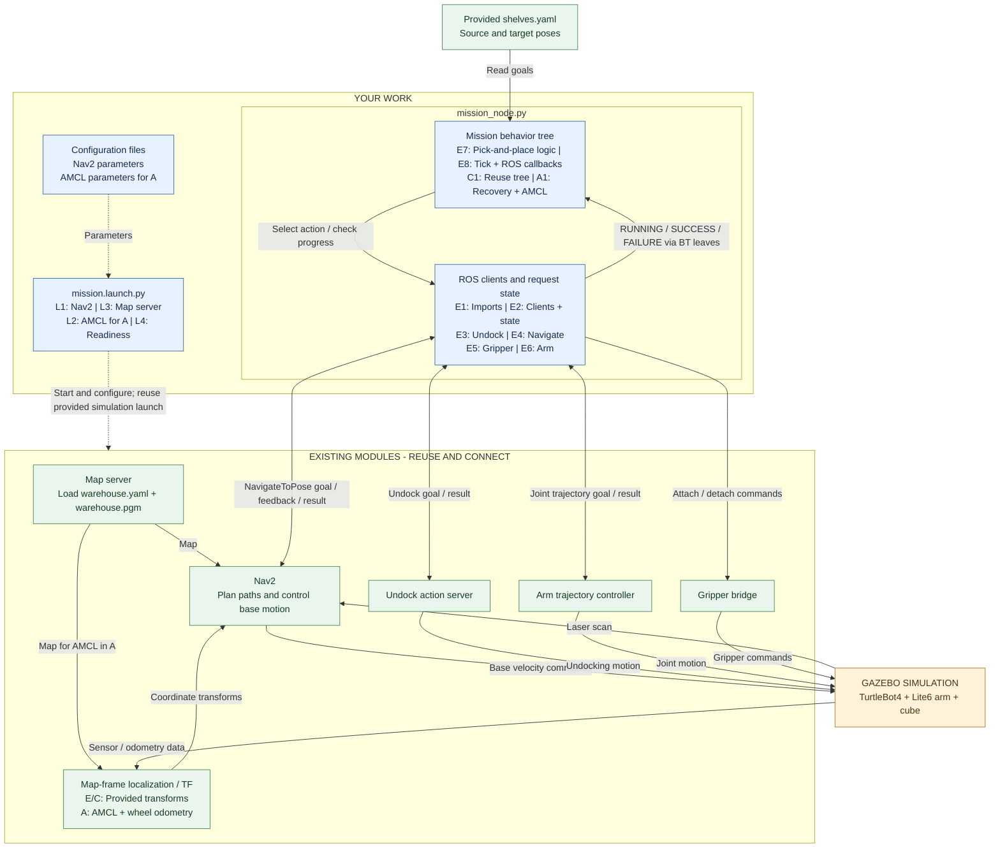
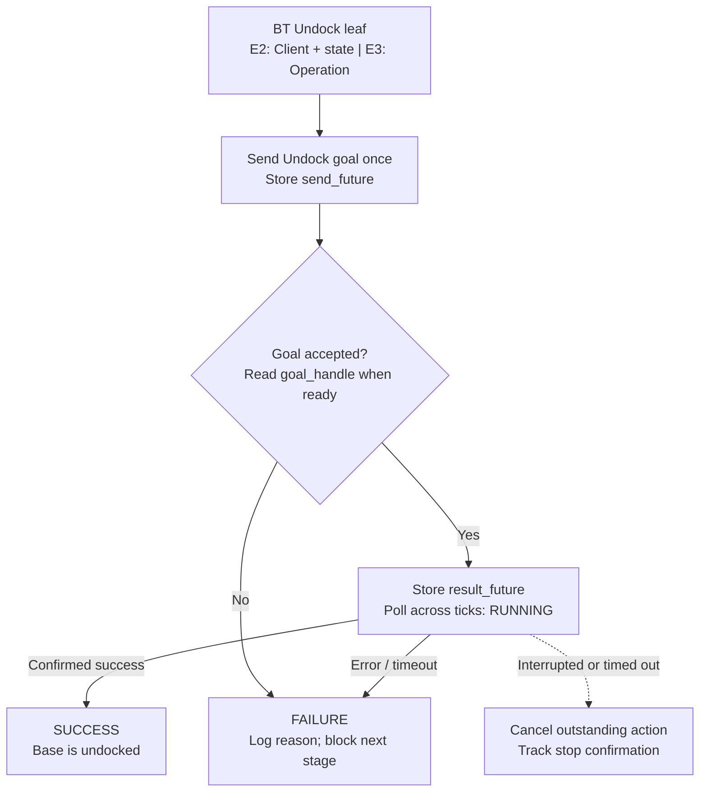
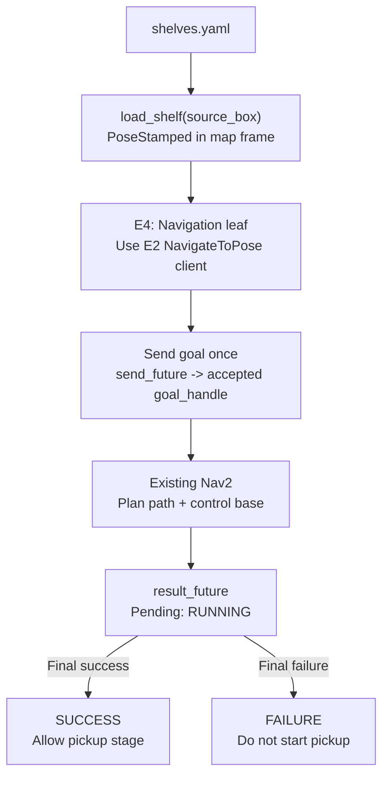
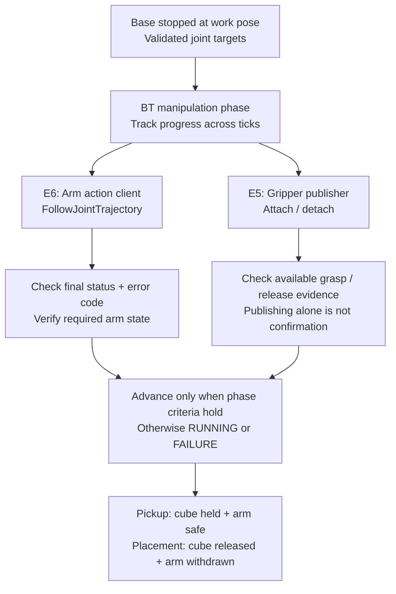
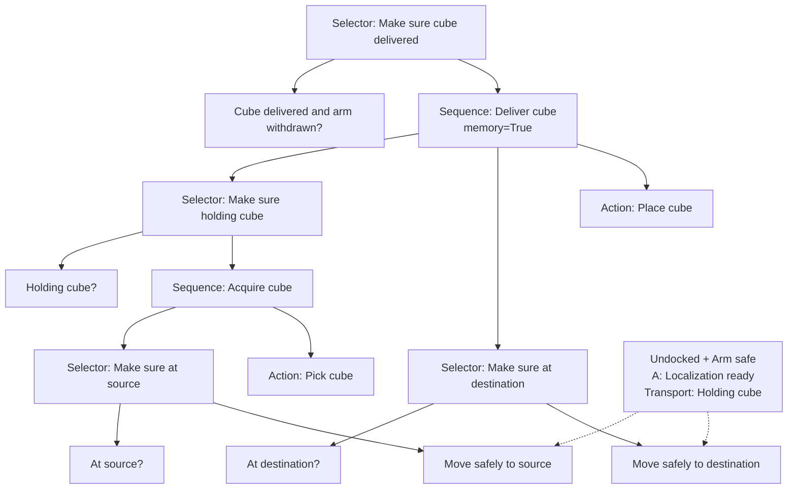

# DD2410 Final Assignment：移动机器人项目中文指南

资料核对日期：2026-09-25。依据：[Canvas 总览](https://canvas.kth.se/courses/63971/pages/final-assignment-mobile-robot-project?module_item_id=1482454)、[详细作业页](https://canvas.kth.se/courses/63971/assignments/381308)、[官方仓库](https://github.com/Ikemura-kei/IROB_Mobile_Robot_Project)和[课程讲义](downloads/IROB_Assignment_5_Presentation.pdf)。源码固定为提交 `1e680dce76b6a149513d3c0ddc0b005c7404d802`，提交日期为 2026-09-22。

下文区分**官方要求**、**本次源码行为**和**选定实施方式**。2026-09-29 更新：按 L8_BT_2026.pdf 第 20–21 页，将任务框架改为课堂的 “Make sure…” 条件子树；E、C、A 共用这一组织方式。已提供叶节点包装和建树代码，观测、ROS 动作及执行循环仍由你们填写。官方原始源码完整保存在 downloads 的 ZIP 中。本次没有重新核实课程公告或截止时间。

## 作业到底要做什么

在 Gazebo 仓库场景中，让装有 Lite6 六自由度机械臂的 TurtleBot4 完成：

```text
脱离充电座 → 到源箱前 → 抓起立方体 → 收回机械臂至安全姿态
          → 搬运到目标箱前 → 放下立方体
```

这是**系统集成与任务规划**作业。底盘、机械臂、地图、传感器和仿真组件已有；你需要连接地图服务、导航、必要的定位模块，并编写行为树来组织动作及处理结果。不是重新实现前几次的建图、逆运动学或路径搜索算法。

**必须两人一组，现场向助教演示并回答问题。两人都要在演示前各自向 Canvas 上传代码，并注明搭档。** 与 Assignment 3、4 不同，本次不是 Kattis 提交。

| 等级 | 任务与场景 | 任务组织方式 | 定位要求 | 按时完成奖励 |
|---|---|---|---|---:|
| E | 源箱取物，送到 target-1；静态场景 | 官方允许状态机或行为树；**本项目选定行为树** | 使用模板提供的 E 级坐标变换 | 3 分 |
| C | 完成 E 要求；送到更远的 target-2，避开动态障碍 | **必须行为树** | 使用模板提供的 C 级坐标变换 | 5 分 |
| A | 完成 E、C 要求；助教随机改变起始位置 | **后向链式行为树**，移动前必须满足“已脱离充电座”和“机械臂安全” | **AMCL，自主确定未知起始位置** | 7 分 |

**统一路线：E 就借鉴课堂的后向展开结构 → C 复用到 target-2 和动态障碍 → A 完成反应式恢复、移动前置条件验证和 AMCL 定位。** 不安排“先写状态机、到 C 再改成行为树”的步骤。基础概念见 [行为树教程](BEHAVIOR_TREE_TUTORIAL.md)。

### 整体框架图：先看清两个文件各自负责什么

下图描述完成作业后的目标结构，不代表当前 TODO 已实现。图中文字全部使用英文：蓝色表示你们要编写或配置的部分，绿色表示复用的现成模块；虚线表示启动/配置关系，实线表示运行时的数据或控制关系。



按以下顺序读图即可：

1. **`mission.launch.py` 负责让系统可用**：启动并配置已有模块，不决定先抓取还是先放置。当前模板采用两个终端，任务节点仍由第二个终端单独启动。
2. **`mission_node.py` 的行为树负责决定下一步**：例如现在去源箱，导航成功后再抓取。
3. **动作客户端负责通信和记录进度**：E2 先创建接口和状态存储，E3–E6 再实现实际请求及结果处理；调用已有模块不等于自己重写导航或机械臂控制算法。
4. **Gazebo 中的机器人实际执行动作**：传感器与动作结果让系统知道执行进展。吸盘的 attach/detach 是单向命令，图中没有把它画成自动返回“抓取成功”的动作接口。

图中省略了 ROS 桥接、底盘内部控制和部分反馈话题，以突出作业结构。`warehouse.yaml` 是提供好的地图描述，Nav2/AMCL 参数文件则是你们需要准备的配置，两者用途不同。Nav2 内部的导航行为树也不等于你们自己编写的任务行为树。

### 截止时间与提交内容：页面存在冲突

| 项目 | 当前官方材料的实际内容 | 本指南采用的处理方式 |
|---|---|---|
| 截止日期 | 总览写 Oct 9；作业页顶部显示 **2026-10-09 17:00**，正文却写 **Oct. 9, 15:00** | 日期确定为 10 月 9 日；在老师澄清前，建议按较早的 **15:00** 安排，不把 17:00 当作确定的奖励分时间 |
| C/A 资格 | 总览要求在 10 月 9 日前至少成功演示 E，才有资格取得 C/A | 不要只提交文件而没有按时演示 E |
| 页面开放结束 | 作业页显示 **2026-12-17 17:00** | 这是上传入口开放结束时间，不是奖励分截止 |
| 提交文件 | 页首、正文第 1 节、讲义第 6 页和仓库均为 `mission_node.py`、`mission.launch.py`；第 4 节仍列旧文件名 `SM_students.py`、`BT_students.py`、`launch_project.launch` | 以当前模板的两个文件为主要交付物；旧命名与当前仓库不一致，提交前确认最新课程通知 |
| 新增配置 | 仓库及讲义明确允许添加 Nav2、AMCL 等配置；Canvas 当前上传界面显示 PY、LAUNCH | 保留所有实际用到的配置；额外 YAML 的提交方式需向助教确认，不假定系统接受 ZIP/YAML |
| 单独演示说明 | [Presenting assignment 5](https://canvas.kth.se/courses/63971/pages/presenting-assignment-5) 本次返回 Access Denied | 尚未核实预约方法、场次、展示时长等；不要据此自行推断 |

以上时间按 Canvas 当前显示记录。总览还说明 11 月和 12 月会有补演示场次，但这不取消 C/A 的按时完成 E 条件。

## 1. 本地材料与文件入口

```text
assignment5/
├── ASSIGNMENT_5_GUIDE.md                 本指南
├── downloads/
│   ├── IROB_Assignment_5_Presentation.pdf  官方讲义，14 页
│   └── IROB_Mobile_Robot_Project_1e680dce.zip
│                                        从官方 Git 提交导出的原始源码快照
├── materials/
│   ├── SOURCES.md                       来源、版本与下载记录
│   ├── CANVAS_REQUIREMENTS_SNAPSHOT.md   网页关键要求摘录及访问限制
│   ├── IROB_Assignment_5_Presentation.txt 讲义全文提取，便于搜索
│   └── SHA256SUMS.txt                    下载文件校验值
└── IROB_Mobile_Robot_Project/            官方仓库浅克隆，保留 .git
    ├── README.md                        先读，当前安装与运行说明
    ├── demo_grade_e.mp4                  官方 E 级演示视频
    ├── relocate_robot.png               A 级重定位操作图
    ├── pixi/pixi.toml                    个人 Linux 环境及运行任务
    ├── scripts/                         环境、清理和配额检查工具
    └── src/Warehouse_robot/
        ├── warehouse_inventory_robot/   本次主要编辑的包
        ├── turtlebot4/
        ├── turtlebot4_simulator/
        ├── create3_sim/
        └── xarm_ros2/
```

源码快照 ZIP 内直接是仓库根目录内容，若以后解压，请解压到一个新的独立目录，不要直接铺到已有 `IROB_ws/src/`。这个仓库本身已经是一个工作空间。

核心包 `src/Warehouse_robot/warehouse_inventory_robot/` 内：

| 文件 | 职责 | 你要做什么 |
|---|---|---|
| `warehouse_inventory_robot/mission_node.py` | 任务节点；已有配置读取、动作客户端、机械臂辅助函数 | 从 E 开始实现任务行为树、动作结果处理和中断管理 |
| `launch/mission.launch.py` | 启动仿真、机械臂控制器、部分 TF 和 A 级重定位辅助节点 | 补地图服务、Nav2、A 级 AMCL、参数与生命周期管理 |
| `launch/simulation.launch.py` | 按 grade 选择世界和里程计模式，启动仿真与 RViz | 阅读并理解，不为完成任务随意修改 |
| `config/shelves.yaml` | 源箱/目标箱前的底盘工作位姿 | 通过已有加载函数读取，不把数值抄进导航逻辑 |
| `config/initial_positions.yaml` | 机械臂初始关节配置 | 作为了解模型的参考，不直接当作已验证的安全抓取姿态 |
| `config/arm_controllers.yaml` | 机械臂轨迹控制器配置 | 核对关节名与控制器 |
| `maps/warehouse.yaml`、`warehouse.pgm` | 已知地图 | 用地图服务加载，无需自己重新建图 |
| `warehouse_inventory_robot/utils/wait_for_ready.py` | 启动就绪检查 | 理解已有启动过程，不重复写同类工具 |
| `warehouse_inventory_robot/utils/relocate_robot.py` | 助教测试用的机器人重定位工具 | 只用于测试未知起点，不作为任务节点的定位数据来源 |

任务文件中已有课堂风格的树结构，英文 TODO 保留核心实现；这不是可直接完成搬运的解答。建议阅读顺序：根目录 README → 行为树教程 → `mission_node.py` → `mission.launch.py` → `simulation.launch.py` → `shelves.yaml`。

### TODO 对照与完成顺序

以下编号位于本地两个模板文件中；原始 ZIP 不作修改。

| TODO | 位置 | 你们需要完成什么 |
|---|---|---|
| L1、L3、L4 | `mission.launch.py` | 从 E 开始启动和配置 Nav2、加载已有地图、管理生命周期与就绪条件 |
| E1、E2 | `mission_node.py` 的导入区、构造函数 | 加入行为树/Nav2 所需导入和客户端，记录异步请求与任务状态 |
| E3 | `undock_robot()` | 脱离充电座的异步操作与结果检查，供行为树叶节点使用 |
| E4 | `go_to_pose()` | 发送一次导航目标并持续检查；支持失败、超时与取消 |
| E5、E6 | 吸盘、机械臂辅助函数 | 将阻塞等待改成适合 tick 的分阶段处理，验证取放和安全姿态 |
| E7 | `build_tree()`、`make_sure_at()` | 已搭课堂式子树；阅读节点与条件的对应关系，连接你的动作实现 |
| E8 | `run_mission()`，配合 `main()` | 保持 ROS 回调与树 tick 正常运行；定义完成、失败和退出处理 |
| C1 | `run_mission()` | 复用 E 的行为树和动作节点，配合 C 的导航配置完成 target-2 搬运 |
| A1、L2 | `build_tree()`、`localization_ready()`、`mission.launch.py` | 完善反应式恢复、AMCL 启动和未知起点定位就绪检查 |

建议先完成 L1/L3/L4，再逐步完成 E1–E8并验证 E，之后扩展 C1，最后完成 A1/L2。叶节点向父节点报告 `RUNNING/SUCCESS/FAILURE`；内部辅助函数可以返回请求句柄或进展数据，不要求所有普通函数直接返回行为树状态。

## 2. 准备环境与运行

### 2.1 机房电脑：推荐路线

以下是**在机房执行**的步骤。2026-09-29 的框架更新包含向 KTH AFS 同步源码；源码同步不等于编译或 Gazebo 运行验证。

首次准备：若目标目录尚不存在，在你选择的父目录执行：

```bash
git clone https://github.com/Ikemura-kei/IROB_Mobile_Robot_Project.git
cd IROB_Mobile_Robot_Project
fs quota
source /etc/profile.d/modules.sh
module add dd2410
pixi shell
```

仓库已存在时先检查自己的修改，不要重复克隆或覆盖。`pixi shell` 会进入子终端，进入后再执行：

```bash
MAKEFLAGS=-j2 CMAKE_BUILD_PARALLEL_LEVEL=2 colcon build --base-paths src/Warehouse_robot --parallel-workers 4
source install/setup.bash
ros2 pkg prefix warehouse_inventory_robot
```

保留两个编译并行度变量。官方 README 解释，多个包同时启动无限制编译可能耗尽机房内存。首次编译可能约 6–10 分钟；实际耗时取决于机器。

**两个运行终端都先进入仓库根目录**，分别执行：

```bash
source /etc/profile.d/modules.sh
module add dd2410
pixi shell
```

进入子终端后，两个终端都执行：

```bash
source install/setup.bash
source scripts/env_vars.sh
```

终端 1：

```bash
GRADE=e ros2 launch warehouse_inventory_robot mission.launch.py
```

终端 2，在所需模块就绪后：

```bash
GRADE=e ros2 run warehouse_inventory_robot mission_node --ros-args -p use_sim_time:=true
```

测试 C、A 时，将**两个终端**的 `GRADE` 同时改为 `c` 或 `a`。A 级先启动终端 1，用 RViz 的 **Publish Point** 改变机器人起点，再启动终端 2。不要将两个终端的等级混用。

如果只想降低 Gazebo 图形开销，终端 1 可用：

```bash
GRADE=e HEADLESS=true ros2 launch warehouse_inventory_robot mission.launch.py
```

这只关闭 Gazebo 的图形界面，RViz 仍会显示。未完成模板时，仿真能启动并不意味着任务会自动执行；当前 `run_mission()` 还没有任务逻辑。

### 2.2 修改后的构建

修改任务代码、launch 或新增配置后，在项目环境中执行：

```bash
colcon build --base-paths src/Warehouse_robot --packages-select warehouse_inventory_robot
source install/setup.bash
```

其他运行终端也重新 source 并重启相应进程。官方构建流程把 Python 文件复制进 `install/`，不能假设编辑源码后旧进程会自动更新。配置中的 YAML 由 `setup.py` 安装到包的 share 目录，也需要重新构建。

当前 README 特别要求使用 `scripts/env_vars.sh`，**不要沿用以前的 `export ROS_LOCALHOST_ONLY=1`**，它可能影响本项目的大型节点图发现。

若上一轮仿真退出不完整，先停止相关终端，再阅读并按需使用官方 `bash scripts/cleanup.sh`。该脚本会匹配当前用户的 Gazebo、RViz 和若干 ROS 进程，不只匹配一个任务节点；使用前确认没有其他需要保留的同用户 ROS 实验。本次没有运行清理脚本。

### 2.3 个人电脑路线的实际限制

`pixi/pixi.toml` **只声明 `linux-64`**。README 中的 “own devices” 不能理解为这份清单已支持 macOS。本机先用来阅读、编辑；运行建议使用机房或兼容的 Linux 环境。

在兼容 Linux 上，从仓库根目录执行：

```bash
pixi shell --manifest-path pixi
```

进入后执行 `pixi run build`。两个运行终端各自进入此环境，再分别运行：

```bash
# Terminal 1
source scripts/env_vars.sh
GRADE=e pixi run mission
```

```bash
# Terminal 2
source scripts/env_vars.sh
GRADE=e pixi run mission-node
```

修改后使用 `pixi run build-mission`。不要用 `pixi run mission -- grade:=c` 代替 `GRADE=c`；清单注释指出该写法可能没有传到 ROS launch。

本路线从 E 开始使用行为树；若采用 `py_trees`，就在 E 阶段先于**实际课程运行环境**检查：

```bash
python -c "import sys, py_trees; print(sys.executable); print(py_trees.__file__)"
```

个人 Linux 清单已列出相关依赖。机房 README 提供 `pip install --user --break-system-packages py_trees`，但同时说明模块 Python 没有 pip，因此不要盲目认为任意 `pip` 与运行节点的 Python 相同；先核对解释器和 pip 的对应关系，必要时按课程帮助配置。本次没有安装它。**C 级也要求行为树**，不能因 README 的安装提示只提到 A 而忽略 C 的要求。

## 3. 理解数据与控制接口

### 3.1 模块如何连接

```text
maps/warehouse.yaml + warehouse.pgm → map_server → 静态地图
Gazebo → 激光/里程计/TF/时钟 → Nav2 → 底盘速度控制
                        └── A 级：AMCL → map→odom

shelves.yaml → PoseStamped(map) → 你的任务节点
                                   ├── /undock 动作
                                   ├── Nav2 NavigateToPose 动作
                                   ├── 机械臂 FollowJointTrajectory 动作
                                   └── 吸盘 attach / detach 话题
```

任务节点决定“下一步做什么”；导航负责“如何移动到工作位姿”；机械臂控制器负责执行关节轨迹。不能因为 launch 已启动 Gazebo，就假设地图服务和导航也已齐全。

### 3.2 已有接口与返回值

| 接口 | 输入 | 输出或作用 | 注意点 |
|---|---|---|---|
| `load_shelf(name)` | 箱子名称字符串 | `geometry_msgs/msg/PoseStamped` | `frame_id='map'`，目标是底盘工作位姿，不是箱子中心 |
| `load_shelves(priority_first=False)` | 是否按 priority 排序 | 字典列表，包含 name、marker_id、priority、pose | 应按名称取目标，不依赖列表顺序 |
| `load_home_base()` | 无 | 地图坐标下的 home 位姿 | 网页列出的 E/C/A 任务并未把返回 home 单列为强制步骤 |
| `undock_robot()` | 无 | 按 E3 实现异步操作，叶节点把进展映射为三种行为树状态 | 当前仍抛出 `NotImplementedError`，不是已实现的 BT 节点 |
| `go_to_pose(pose_stamped)` | 目标工作位姿 | 按 E4 实现导航请求与查询，供行为树叶节点使用 | 当前只更新时间戳并打印日志，隐式返回 None |
| `move_arm_to_joint_angles(angles, duration_sec=4)` | 6 个关节角，按 `arm_joint1…6` 排列；弧度 | 向轨迹动作服务器发送单点目标 | 默认时长为整数秒；函数当前未完整核对最终动作成功状态 |
| `toggle_vacuum(enable=True)` | 布尔值 | 发布 attach 或 detach 的 `Empty` 消息 | 没有成功返回值，等待 1.5 秒不等于确认抓取成功 |
| `run_mission()` | grade、配置、实时状态 | 编排任务 | 当前只初始化吸盘并加载目标，主流程仍是 TODO |

| 名称 | 类型 | 当前状态 |
|---|---|---|
| `/undock` | `irobot_create_msgs/action/Undock` | 模板已创建客户端 |
| `/lite6_traj_controller/follow_joint_trajectory` | `control_msgs/action/FollowJointTrajectory` | 模板已创建客户端和发送辅助函数 |
| `/vacuum_gripper/attach`、`/vacuum_gripper/detach` | `std_msgs/msg/Empty` | 模板已有发布器 |
| 通常为 `/navigate_to_pose` | `nav2_msgs/action/NavigateToPose` | 你需要启动 Nav2 并创建客户端；以运行时 action 列表确认名称 |
| `/scan`、`/clock`、TF | 传感器、仿真时间和坐标变换 | 已有启动就绪工具检查其中部分数据；仍需运行时核实 |

### 3.3 目标位姿的含义

当前 `shelves.yaml` 与 `mission_node.py` 对应：

| 用途 | 配置名称 | x（米） | y（米） | yaw（弧度） |
|---|---|---:|---:|---:|
| 所有等级的源箱 | `shelf_7_ID11` | 1.98 | 7.15 | 1.57 |
| E 的 target-1 | `shelf_7_ID10` | -0.9 | -0.8 | -1.57 |
| C/A 的 target-2 | `shelf_7_ID20` | 13.24 | -22.07 | 1.57 |

这些是本次快照中的数值，**不要硬编码到移动序列**。已有 `load_shelf()` 会把 yaw 转成四元数；平面情况下 `z=sin(yaw/2)`、`w=cos(yaw/2)`。朝向决定机械臂面向箱子的一侧，只有位置正确仍可能抓不到。

源箱附近的 YAML 注释残留了与数值不一致的位置/方向文字，例如 `yaw=1.57` 附近写着 facing -y。应结合实际数值、TF 与仿真几何验证，不能只看注释认定方向。`marker_id` 当前只是加载出的标识，本次模板没有让你必须编写 ArUco 检测器。

### 3.4 E/C 与 A 的 TF 区别

| TF 边或数据 | E/C 模板 | A 模板 |
|---|---|---|
| `map → odom` | `mission.launch.py` 启动静态变换 | 静态变换关闭，应由你集成的 AMCL 提供 |
| `odom → base_link` | 仿真真值桥接 | 轮式里程计，有漂移 |
| 场景 | E 静态，C 动态 | 动态 |

遵守模板的等级切换，不要在 A 级重新打开 E/C 的真值桥接来掩盖定位问题，也不要让静态发布器和 AMCL 同时发布 `map → odom`。Canvas 明确禁止任务解法读取 `/gazebo/model_states` 等模型真实状态来判断定位、碰撞或是否到达。

## 4. E 级实施路线

以下是建议开发顺序，不是已经完成的代码。每一步先获得明确的运行证据，再接到完整任务中。

### 第一步：补齐启动文件

**输入：** 官方地图、ROS 包和导航参数。**输出：** 地图服务及所需导航节点可用，坐标变换完整，导航动作服务器可被发现。

1. 保留现有仿真、机械臂控制器和 grade 参数逻辑。
2. 添加地图服务，指向安装目录内的 `maps/warehouse.yaml`。
3. 添加 Nav2 所需的规划、控制、导航行为及生命周期管理。可复用安装环境里的 Nav2 bringup；先核对它会启动什么，避免重复启动地图或 AMCL。
4. 将自己的导航 YAML 放到包的 `config/`，从包 share 路径读取。
5. 一致设置 `use_sim_time`，检查 map、odom、base frame 和激光 frame 的连接。
6. 确认生命周期节点为 active，不能只以进程已启动为成功标准。

当前 Nav2/AMCL 专用配置尚未提供。不要把 ROS 1 的导航示例直接复制进 Jazzy；Canvas 的部分背景链接确实仍指向旧版文档。

### 第二步：独立完成脱离充电座

**输入：** `/undock` 动作服务器和机器人当前状态。**输出：** 成功脱离后，任务才允许进入导航。



图中从发出请求到收到接受回复期间也返回 `RUNNING`；发送前先确认服务器可用，并设置等待时限。`send_future`、`goal_handle`、`result_future` 分别保存“接受回复”“这次任务的句柄”“最终结果”，不是三次不同的脱离请求。

动作处理至少区分：服务器不可用、目标未接受、正在执行、最终成功、最终失败或超时。若失败，记录原因并停止后续搬运；不要固定等待若干秒后直接把 `undocked` 设为 True。

### 第三步：独立验证单个导航目标

**输入：** `load_shelf(self.source_box)` 返回的地图工作位姿。**输出：** 底盘到达该位置及朝向，动作结果确认成功。



这里的 `PoseStamped` 是底盘在源箱前应达到的位置和朝向。图中只画正常接受后的主路径；拒绝、超时、中断仍按第二步的规则处理。后续导航到目标箱时复用同一套操作，只替换输入位姿。

先只验证脱离充电座后到源箱，不要同时调抓取。导航目标被接受与最终到达是两件事。保存 goal handle，等待结果并检查状态；新目标到来时要有明确的取消、替换或排队策略，防止旧回调推动新任务进入下一阶段。

### 第四步：机械臂取放与安全姿态

**输入：** 已停稳且朝向正确的底盘、6 个关节目标角和吸盘命令。**输出：** 立方体随机械臂抬起；搬运前机械臂进入已验证的安全姿态。



两条分支表示这个阶段会使用两种接口，**不表示机械臂和吸盘应当同时启动**。具体先后次序由阶段逻辑决定；只有当前步骤完成才进入下一步。图中“抓取/释放证据”需要结合实际可用反馈定义，不能假设模板已经提供了抓取成功信号。

建议拆成“接近 → 接触/吸附 → 抬起 → 收回”以及“接近放置位置 → 释放 → 撤离”。本指南不提供未经仿真验证的抓取角度。使用模型和官方演示观察姿态，并保留可调整的关节角与动作时长。

现有辅助函数需要特别留意：

- `move_arm_to_joint_angles()` 只检查等待是否结束，没有在返回 True 前检查最终 action 状态和轨迹结果错误码；不能把它现有的 True 当成完全可靠的动作成功证据。
- `toggle_vacuum()` 是发布命令，没有抓取反馈。至少在仿真中验证实际吸附效果，并在任务设计中明确哪些状态是观测、哪些只是命令后的推断。
- `time.sleep()` 使用墙钟时间；Gazebo 运行缓慢时，经过 1.5 秒墙钟不代表仿真中机械臂或吸盘已完成动作。运行时间与动作完成应分开处理。

### 第五步：连接 E 级基础行为树（E7、E8）



这张图对应当前 `build_tree()`；两个移动子树由 `make_sure_at()` 分别创建。读法与课件一致：**条件已经满足就跳过动作，否则执行建立该条件的子树。** 细节与完整树见 [教程第 11.5 节](BEHAVIOR_TREE_TUTORIAL.md#115-当前代码如何对应课堂无人机例子)。图中 Transport 条件只用于去目标箱的移动。

与课件第 16 页声明的纯反应式版本有一处有意区别：`Deliver cube` 使用 `memory=True`，以便释放物体后的撤臂阶段继续执行。其内部的移动子树仍使用 `memory=False`，每轮重新检查脱离、机械臂安全和运输时持物条件。这个选择不是完整 A 级解答；中断取消、条件恢复和 AMCL 仍须实现并验证。

当前 `run_mission()` 只建树、打印树，并用明确的 `NotImplementedError` 停止，**不向机器人发送动作**。完成核心 TODO 后再替换 E8 的停止语句，接入回调和 tick 循环。

建议先定义以下职责：

| 行为/阶段 | 进入条件与输入 | 允许前进的条件 |
|---|---|---|
| 等待就绪 | 所需节点、地图、TF、动作服务器 | 依赖真实可用 |
| 脱离充电座 | 当前停靠状态或脱离动作 | 成功结果 |
| 前往源箱 | 源箱工作位姿 | 导航成功 |
| 抓取 | 底盘停稳、工作位姿满足要求 | 抓取阶段完成且证据合理 |
| 收回机械臂 | 携物状态、目标安全姿态 | 机械臂达到安全条件 |
| 前往目标箱 | 当前等级的目标位姿 | 导航成功 |
| 放置 | 底盘停稳、机械臂可以接近目标 | 立方体释放到目标箱 |
| 完成/失败 | 所有阶段结果或失败原因 | 停止继续发送无效命令并记录状态 |

从 E 就让动作叶节点正确返回 `RUNNING/SUCCESS/FAILURE`。首次进入时发送一次请求，后续 tick 检查同一请求；动作结果或状态条件决定何时前进。定时器用于周期检查和超时，不用“过了固定时间”替代“已经成功”。

取物、搬运、放置要有明确的阶段推进，避免无记忆顺序树在去目标箱途中重新要求返回源箱。导航的安全检查仍应持续生效，不能用组合节点的记忆跳过所有前置条件。树的基本规则与这一反例见 [教程第 10–11 节](BEHAVIOR_TREE_TUTORIAL.md)。

**E8 的入口注意事项：** 当前 `main()` 调用 `run_mission()`，后者返回后立即销毁节点。若只在 `run_mission()` 创建一个 tick 定时器后就返回，任务不会持续运行。需要安排执行器持续处理 ROS 回调，并在任务结束时管理仍未完成的动作；现有初始化 sleep 也需结合此运行方式处理。

## 5. C 级：复用 E 的行为树，扩展动态避障

**官方新增要求：必须行为树、送到 target-2、避开动态物体、不能硬编码机器人移动。助教可以更换目标参数。** E 的演示与问题仍然有效。

本路线在 E 已采用行为树，因此 C 不需要从状态机重写。下面前 3 项是 E 阶段就应建立的基础，C 继续验证并复用；重点新增的是较远目标、动态环境和对应导航配置。

建议实现方式：

1. 用独立行为节点封装脱离充电座、导航、机械臂动作与吸盘操作；成功、失败和进行中分别对应 `SUCCESS`、`FAILURE`、`RUNNING`。
2. 异步动作首次进入时发送一次目标，后续 tick 检查同一个 future；不能每次 tick 重新发一个导航目标。
3. 如果把 BT tick 放在 ROS 回调内，不要直接照搬会长时间阻塞或嵌套 spin 的同步辅助函数；应让 ROS executor 持续处理反馈和结果。也可以设计清晰的外层执行循环，但必须说明谁在驱动 ROS 回调。
4. 让 Nav2 根据激光更新局部障碍并执行避障/重规划，不要用“直行 N 秒、转弯 M 秒”作为到远处目标的路线。
5. 测试暂停、动态障碍靠近、导航失败、新目标请求时，任务是否保持一致状态。中断动作时明确取消或停止，避免底盘和机械臂仍在执行旧任务。

通过读取配置生成目标位姿，才能适应位置变化。当前 `load_shelf()` 按名称查找，不依赖配置列表顺序；若助教给出的配置修改了名称，需要同步确认名称约定，不能无声选择错误箱子。

## 6. A 级：后向链式行为树与 AMCL

### 6.1 后向链式结构的含义

从“希望成立的条件”出发：先检查条件，若不成立，再执行能让它成立的行为。例如一个概念上的移动子树可以是：

```text
Fallback：已到目标？
├── Condition：AtGoal
└── Sequence：满足前置条件后移动
    ├── Fallback：Undocked？否则执行 Undock
    ├── Fallback：ArmSafe？否则执行 MoveArmSafe
    ├── Condition：LocalizationReady（建议额外条件）
    └── Action：NavigateToGoal
```

这一模式现已体现在 `make_sure_at()` 的结构中，但条件观测和动作实现仍是 TODO。官方明确要求的是“已脱离充电座”和“机械臂安全”为 Move 的前置条件；定位就绪是这里的实施建议。

不要只把线性动作串外面包一层树。条件应反映当前状态；采用能重新检查前置条件的 tick 方式，并明确条件失效时如何停止正在运行的动作。任务阶段也要记住是否已抓取/放置，避免反复 tick 重复执行有副作用的操作。

### 6.2 自主定位路线

**输入：** 已知静态地图、激光、轮式里程计、未知起点。**输出：** 可信的地图位姿及 AMCL 提供的 `map → odom`。

1. 仅 A 级启动 AMCL，并管理地图服务和 AMCL 的生命周期。
2. 仿真启动后，用 **Publish Point** 随机放置机器人及充电座，再启动任务节点。官方工具可能拒绝不安全的位置。
3. 处理未知起点初始化；不能把用户点击坐标或模拟器真实位置直接传给任务定位作为答案。
4. 按作业提示，脱离充电座后原地旋转，使激光获得更多方向的观测；观察粒子云、位姿稳定性和与地图的一致性。
5. 定位满足自己定义且能解释的条件后才进入导航；等待要有超时与明确失败日志。

AMCL 提供全局重定位相关机制，具体服务可用运行时列表确认，参考 [Nav2 Jazzy 的全局重定位说明](https://docs.nav2.org/jazzy/configuration_and_development/configuration_guide/core_servers/bt_plugins/actions/ReinitializeGlobalLocalization/)。小协方差本身不能保证估计正确，重复结构中可能收敛到错误区域；需要结合传感器与地图的一致性判断。

原地旋转是获取更多观测的一种方法，不保证任何位置都能收敛。仓库结构相似、视野受限、传感器配置错误或 TF 不完整，都可能造成定位困难。当前 README 把随机重定位测试安排在任务开始前；“运行中被移动怎么办”可作为答辩讨论，但不要误写成官方必做的全部恢复机制。

## 7. 调试顺序与命令

以下在**课程环境且已经 source 工作空间**的终端执行。命令用于检查，不能证明本次已经运行过。

### 基础发现与动作接口

```bash
ros2 node list
ros2 topic list -t
ros2 action list -t
ros2 service list -t
ros2 node info /mission_node
ros2 action info /undock
ros2 action info /lite6_traj_controller/follow_joint_trajectory
ros2 interface show irobot_create_msgs/action/Undock
ros2 interface show nav2_msgs/action/NavigateToPose
ros2 interface show control_msgs/action/FollowJointTrajectory
```

任务节点未启动或立即返回退出时，`ros2 node info /mission_node` 找不到节点是合理现象；当前未实现的 `run_mission()` 就可能很快返回。

### 先检查数据与生命周期，再调算法

```bash
ros2 topic echo /clock --once
ros2 topic hz /scan
ros2 control list_controllers
ros2 run tf2_ros tf2_echo map base_link
ros2 run tf2_tools view_frames
ros2 lifecycle get /map_server
```

`topic hz`、`tf2_echo` 等持续运行的检查用 Ctrl-C 结束。map_server 是补齐 launch 后才会出现的节点；如果你使用了命名空间，相应替换节点名。

官方 launch 注释专门提到：冷启动时 lifecycle manager 的服务调用可能超时，使地图服务停在 inactive。先核对日志和状态；**仅当已确认处于 inactive 且配置正确**时，可用下面命令验证激活是否解决问题：

```bash
ros2 lifecycle set /map_server activate
```

这是一条诊断操作；最终仍应让 launch 正确完成生命周期转换。

### 底盘不动时检查消息类型

```bash
ros2 topic info /cmd_vel -v
ros2 topic info /cmd_vel_unstamped -v
```

本次底层 `motion_control_node.cpp` 对 `cmd_vel` 订阅 `TwistStamped`，另有 `cmd_vel_unstamped` 的 `Twist` 入口。Nav2 的输出类型、remapping 与底盘输入必须一致；不能看到同样的 `/cmd_vel` 名称就认定已经接通。最终以你实际启动的发布/订阅信息为准。

### 常见现象

| 现象 | 优先检查 |
|---|---|
| 仿真有机器人但任务不执行 | `run_mission()` 是否仍为 TODO；节点是否已经返回退出 |
| Nav2 action 不存在 | 导航部分是否加入 launch、配置是否有效、生命周期是否 active |
| RViz 没有地图 | map_server 是否启动和 active、地图路径、`/clock`、TF |
| 地图与机器人漂移/跳变 | A 是否错误保留静态 map→odom；是否同一条 TF 有多个发布者 |
| 底盘收到目标却不动 | 是否已脱离充电座；速度话题的名称、类型和接收方 |
| 机械臂动作服务器一直等不到 | `lite6_traj_controller` 是否 active、控制器启动是否失败 |
| 导航显示成功但抓不到 | 最终朝向、停靠距离、关节目标和吸附位置是否匹配 |
| 接受动作后任务直接进入下一步 | 是否把 accepted/future.done 当成 STATUS_SUCCEEDED |
| 行为树卡住、不处理传感器 | tick 是否阻塞 executor，是否在回调内嵌套同步等待 |
| C/A 仍前往近处目标 | 两个终端 GRADE 是否一致，日志中的 source/drop 是否正确 |
| 修改后没有变化 | 是否重新 build/source，并重启节点；是否读了旧安装目录 |
| 仿真第二轮表现异常 | 上轮 Gazebo/ROS 进程是否仍存活，再检查官方 cleanup 工具 |

## 8. 双人分工与验收

建议一人负责 `mission.launch.py` 中现成模块的启动和配置：加载已有地图、集成 Nav2，A 级再集成 AMCL；另一人负责 `mission_node.py` 中从 E 开始的行为树、动作客户端及取放流程。无需从零实现地图、导航、定位算法或机械臂控制器，必要时添加 YAML 配置。**每个阶段一起验证接口，最后两人都能讲清完整系统**。这只是分工建议，不改变课程对合作与个人答辩的要求。

### 阶段验收

- [ ] 环境：能编译官方工作空间，认识两个终端分别负责什么。
- [ ] 启动：地图、TF、传感器、机械臂控制器及导航均就绪。
- [ ] E 单步：脱离充电座、到源箱、抓取、收臂、到 target-1、放置分别验证。
- [ ] E 完整：基础行为树正确处理 RUNNING/SUCCESS/FAILURE，从原始场景完成一整轮，失败有明确日志。
- [ ] E：每次动作激活只发送一次请求，tick 不阻塞 ROS 回调；任务阶段不会意外重跑，退出时管理未完成动作。
- [ ] C：复用 E 的行为树与动作节点，在动态场景完成 target-2 搬运。
- [ ] C：改变合法目标位姿后仍能执行，不依赖固定时间的底盘动作序列。
- [ ] A：测试多个未知起点，靠 AMCL 而非真值恢复定位。
- [ ] A：Move 的前置条件在树结构及运行逻辑中均得到保证。
- [ ] 演示前恢复官方原始场景；开发期便利修改不能成为解法的隐藏依赖。
- [ ] 两人分别上传当前 `mission_node.py` 和 `mission.launch.py`，注明搭档。
- [ ] 向助教确认新增配置的提交方式及截止时间冲突，保留全部运行所需文件。
- [ ] 按时完成至少 E 的现场演示，以保留 C/A 资格。

Canvas 说明，有些仿真或导航故障不属于任务解法需要解决的范围：需要记录并在终端显示，现场可能允许重试。这不代表可以省略自己的错误处理，也不能用“仿真偶然失败”掩盖确定的接口错误。

## 9. 答辩准备方向

以下问题来自 Canvas 的评估方向；括号中的检查点是学习建议，不是官方标准答案。

1. **E：开始前或运行中移动机器人，会怎样？** 分清任务阶段、导航反馈、当前定位与坐标变换；不能只答“重新发送目标”。
2. **E：旧目标还没完成又来新目标，怎么办？** 说明取消/替换/排队策略以及如何避免旧结果改变新状态。
3. **C：柱子或障碍位置改变，为什么仍能避障？** 解释静态地图、实时观测、代价地图、规划与控制之间的职责。
4. **C：如何支持更多目标？** 说明配置读取、名称与位姿分离、通用导航行为，避免把特定路线写死。
5. **A：为什么旋转有助于 AMCL？** 新方向观测可以区分不同位置假设，但环境重复时仍可能歧义。
6. **A：粒子分布说明什么，为什么不收敛？** 解释多假设、不确定性、重采样及观测一致性，联系当前 TF 和传感器配置。
7. **A：等待服务或动作结果时，何时使用定时器？** 定时器可用于检查与超时；真实完成由 future/result/state 决定，不能阻塞必要回调。
8. **A：后向链式行为树与顺序调用的差别是什么？** 用“条件已成立则跳过，否则执行修复行为”的例子解释，并说明运行中条件改变时的行为。

## 10. 本次整理的验证边界

已读取当前 Canvas 总览和详细作业页；已保存并校验 14 页讲义，提取全文并查看关键分级/文件要求页；已下载官方仓库、生成固定提交的 ZIP 并通过完整性检查；已阅读任务模板、启动链、配置加载、环境清单及相关底盘接口。

**尚未在 ROS/Gazebo 中运行、没有验证导航或抓取成功，也没有完成作业算法。** 2026-09-29 已提供课堂风格的建树框架，核心实现保留 TODO；模拟条件/动作的树结构测试通过。官方 ZIP 和 PDF 保持不变。演示专页访问受限，预约细则未核实；截止时间与旧文件名冲突已如实记录。


## 10. 当前课堂框架的实现边界（2026-09-29）

- 已有：`ConditionBehavior`、`ActionBehavior`、`UndockBehavior`，以及 `build_tree()` / `make_sure_at()` 组树。
- 待完成：条件观测、Undock 接受与结果处理、导航、抓放分阶段逻辑、取消与超时、E8 执行循环、A 的定位。原有 Undock 只写到首次发送请求，后续调用仍未返回有效状态。
- `ActionBehavior` 只做返回类型检查；它还不会取消 ROS 请求。树将节点置为 INVALID 不等于机器人已停止。
- 本地 launch 引用了尚不存在的 `config/nav2_params.yaml`，仍需完成参数配置。地图生命周期管理器已改名为 `lifecycle_manager_map`，避免与 Nav2 自带的管理器重名。
- 同步后须在机房课程环境的项目根目录重新编译主包，并重新 source：

```bash
colcon build --base-paths src/Warehouse_robot --packages-select warehouse_inventory_robot
source install/setup.bash
source scripts/env_vars.sh
```

树结构测试使用模拟条件/动作，不发送 ROS 请求；通过测试不表示仿真搬运通过。
