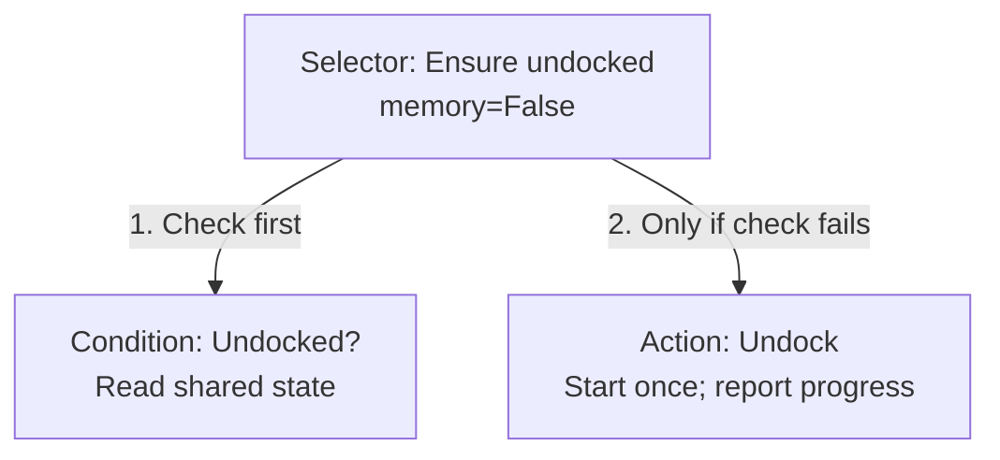

# 行为树与后向链式行为树：从零理解到 Final Assignment

编写日期：2026-09-28。适合第一次学习行为树的读者。

2026-09-29 补充：第 11.5 节对照课堂无人机例子解释当前代码结构；第 13.5 节新增 **Undock 完整代码样例**，包括组树、运行、自检、逐轮解释以及 ROS 接口对应关系。想先看“到底怎么写”，可在读完第 1–6 节后直接搜索 `13.5`。

你提到的“后项链式行为树”，这里按课程中的 **Backward-Chained Behavior Tree（后向链式行为树）** 解释，也称基于后向推理构造的行为树。

本文是学习教程。作业关联依据已保存的 2026-09-25 材料，不代表重新核实了课程公告；具体作业入口见 [Final Assignment 中文指南](ASSIGNMENT_5_GUIDE.md)。本文中的树、动作名称和数据都是教学示例，不是已经完成或经过 Gazebo 验证的作业解法。

**你们已选定的实现路线：E 就使用基础行为树，C 复用并扩展到远处目标和动态障碍，从 E 就借鉴课堂后向展开结构，A 再完善反应式恢复及 AMCL 定位。** 官方 E 允许状态机，但本教程和本地 TODO 统一按行为树推进，不再安排状态机版本。

## 如何阅读

建议分三次读，不必一次记住全部术语。

| 学习阶段 | 阅读内容 | 达到什么程度 |
|---|---|---|
| 第一遍 | 第 1–6 节 | 能手动判断一棵小树本轮执行哪些节点、返回什么状态 |
| 第二遍 | 第 7–10 节 | 能从“到达目标”倒推出条件和动作，理解反应性与中断 |
| 第三遍 | 第 11–15 节 | 能把树映射到 ROS 动作，并识别搬运任务中的状态问题 |

先记住一句话：**行为树决定当前应该执行什么；具体动作节点负责向已有机器人模块发出请求，并报告进展。**

## 1. 为什么机器人需要行为树

假设任务是把立方体从源箱搬到目标箱。最直观的想法是写一个顺序流程：

```text
脱离充电座
导航到源箱
抓取
机械臂收回
导航到目标箱
放置
```

这个流程描述了正常情况下的先后顺序，但还没有回答：

- 导航还在进行时，程序应该做什么？
- 机器人本来就已脱离充电座，是否还要再执行脱离动作？
- 机械臂尚未收回，能否开始移动？
- 导航失败后，是否仍然执行抓取？
- 正在移动时，某个必要条件失效，怎样停止旧动作？

行为树将这些决策组织成一棵树。你不必把全部判断都塞进一个很长的函数，而是把“检查条件”“执行动作”“按顺序组合”“尝试替代方案”分开。

行为树也不是万能算法：它不会自动计算避障路径或机械臂轨迹。这里仍由 Nav2、轨迹控制器等模块完成底层任务。

## 2. 一棵树由什么组成

先看一棵很小的树：

```text
Sequence：按顺序执行
├── Condition：机械臂安全吗？
└── Action：导航到目标
```

从根节点开始读。文本图中的同级子节点按**从上到下**排列，等价于横向图中的从左到右。

| 元素 | 中文含义 | 做什么 |
|---|---|---|
| Root | 根节点 | 整棵树的入口；上图的 Sequence 就是根，不一定另加 Root 类 |
| Composite | 组合节点 | 按规则访问子节点，例如 Sequence、Fallback |
| Condition | 条件节点 | 检查一个命题现在是否成立 |
| Action | 动作节点 | 发起或监测一项操作 |
| Leaf | 叶节点 | 没有子节点的节点，条件和动作通常都是叶节点 |

“机械臂安全吗？”只检查状态，**不会自动让机械臂收回**。要改变机械臂姿态，需要另一个“收回机械臂”的动作节点。

同样，“已到目标？”和“导航到目标”也不是同一个节点：前者读状态，后者改变状态。

## 3. 三种返回状态

行为树节点通常向父节点报告三种执行结果：

| 状态 | 含义 | 导航示例 |
|---|---|---|
| `SUCCESS` | 条件成立，或该节点定义的任务成功 | 已经确认导航成功 |
| `FAILURE` | 条件不成立，或任务失败 | 目标被拒绝、执行失败，或超过规定时限 |
| `RUNNING` | 尚在进行，暂时没有最终结果 | 导航正在执行 |

**尚未完成不等于失败。** 假如一次导航需要 20 秒，在这段时间里返回 `RUNNING` 是正常现象。

普通条件节点一般只返回 `SUCCESS` 或 `FAILURE`，因为它是在检查当前状态。若需要“等待传感器数据到达”，可以单独设计一个等待行为，它在等待期间返回 `RUNNING`。不要无意中把数据未知当成条件已经成立。

注意，条件返回 `FAILURE` 未必意味着系统出错。例如“已到目标？”返回失败，只表示“还没到”；后面的分支可能正是用来解决这个问题的。

库还可能有管理状态。例如 `py_trees` 的 `INVALID` 表示节点尚未运行或已不再处于活动分支，不是通常由 `update()` 返回的第四种任务结果。[参考：py_trees 的节点状态](https://py-trees.readthedocs.io/en/devel/behaviours.html#status)

## 4. tick：树如何一步步运行

**一次 tick，是请求根节点根据当前状态进行一轮决策。** 根节点按自己的规则访问子节点，返回本轮状态。程序随后还会发出下一轮 tick。

可以把外层运行方式理解为以下伪代码：

```text
任务仍需执行时：
    让 ROS 处理传感器、动作反馈和结果
    给根节点一次 tick
    根据根节点结果决定继续、完成或处理失败
```

实际程序可以使用定时器驱动 tick；例如每 0.1 秒一轮只是教学例子，不是作业规定频率。

### tick 不等于重新开始动作

如果“导航到目标”连续十轮返回 `RUNNING`，通常表示你在连续检查**同一个导航请求**，而不是已经发送十次目标。

```text
第 1 轮：首次进入导航动作，发送目标，保存请求信息 → RUNNING
第 2 轮：目标仍在执行，检查已有请求             → RUNNING
第 3 轮：目标仍在执行，检查已有请求             → RUNNING
第 4 轮：收到最终成功结果                       → SUCCESS
```

同一轮 tick 也可能访问多个节点。例如几个条件都立即成功，树可以在本轮继续访问后面的动作。

**tick 从根开始，并不意味着每一轮都会访问所有节点。** 哪些分支会被访问，取决于组合节点和当前返回状态。

## 5. Sequence：前面成功，才继续后面

`Sequence` 可以译为“顺序节点”。先按不带记忆的版本理解。

它按顺序访问子节点：遇到成功就继续；遇到失败或进行中就停止本轮向后访问，并返回那个状态；全部成功才返回成功。[参考：Sequence](https://py-trees.readthedocs.io/en/devel/composites.html#sequence)

```text
Sequence
├── A
├── B
└── C
```

| A 返回 | B 返回 | C 返回 | Sequence 返回 | 为什么 |
|---|---|---|---|---|
| FAILURE | 未访问 | 未访问 | FAILURE | A 不满足，后面不执行 |
| RUNNING | 未访问 | 未访问 | RUNNING | 等 A 完成 |
| SUCCESS | RUNNING | 未访问 | RUNNING | B 还在执行 |
| SUCCESS | FAILURE | 未访问 | FAILURE | B 失败 |
| SUCCESS | SUCCESS | SUCCESS | SUCCESS | 全部完成 |

这里的“停止本轮向后访问”不是终止整个程序；下一轮仍可能重新 tick。

### 用在作业中

```text
Sequence
├── 已脱离充电座？
├── 机械臂安全？
└── 导航到目标
```

假设已脱离充电座，但机械臂不安全：

1. 第一个条件返回 `SUCCESS`。
2. 第二个条件返回 `FAILURE`。
3. 导航节点不被访问。
4. 根返回 `FAILURE`。

这棵树**阻止了不满足条件的导航，但没有修复不满足的条件**。下一节会解释如何补上修复行为。

## 6. Fallback / Selector：前面不满足，再尝试后面

本文用 `Fallback` 表示“回退节点”；`py_trees` 中对应的常用名称是 `Selector`。它按优先级访问子节点：失败才尝试下一个；成功或进行中就停止本轮向后访问；全部失败才返回失败。[参考：Selector](https://py-trees.readthedocs.io/en/devel/composites.html#selector)

```text
Fallback
├── A：优先尝试
├── B：A 失败才尝试
└── C：A、B 都失败才尝试
```

| A 返回 | B 返回 | C 返回 | Fallback 返回 |
|---|---|---|---|
| SUCCESS | 未访问 | 未访问 | SUCCESS |
| RUNNING | 未访问 | 未访问 | RUNNING |
| FAILURE | SUCCESS | 未访问 | SUCCESS |
| FAILURE | RUNNING | 未访问 | RUNNING |
| FAILURE | FAILURE | FAILURE | FAILURE |

**Fallback 不是并行执行，也不是随机选择。** 左侧或上方的孩子有更高优先级。

### 最重要的二节点结构

```text
Fallback：确保机械臂安全
├── Condition：机械臂已经安全？
└── Action：将机械臂移动到安全姿态
```

机械臂已安全：条件成功，跳过动作。机械臂不安全：条件失败，执行收回动作。收回尚未完成：整棵小树返回 `RUNNING`。动作确认完成后才返回成功。

它表达的是：**已经满足就直接通过；没有满足就尝试使其满足。**

### Sequence 与 Fallback 放在一起记

| 组合节点 | 什么时候继续看下一个孩子 | 什么时候本轮停下 |
|---|---|---|
| Sequence | 当前孩子 SUCCESS | 当前孩子 FAILURE 或 RUNNING |
| Fallback | 当前孩子 FAILURE | 当前孩子 SUCCESS 或 RUNNING |

可以暂时把它们类比成带有“尚在执行”状态的 AND 与 OR，但它们还有访问顺序和动作副作用，不能完全按普通布尔代数随意交换孩子。

## 7. 什么是后向链式行为树

“后向”描述的是**设计时的推理方向**：从希望得到的结果出发，倒推什么动作能得到该结果，以及动作需要什么条件。

```text
希望什么成立？
    ↓
哪个动作能让它成立？
    ↓
这个动作执行前需要什么？
    ↓
若前置条件不成立，哪个动作能建立它？
```

例如：

```text
希望机器人已到目标
    ← 需要执行导航
        ← 导航前必须脱离充电座
            ← 若未脱离，执行脱离动作
        ← 导航前机械臂必须安全
            ← 若不安全，执行收回动作
```

设计时从结果往回找原因；**实际执行仍是先准备，再导航**，不会倒着执行物理动作。

这是已有行为树节点的一种构造方式，不需要新造一种“后向节点”。相关研究用这一思路不断展开未满足条件；你可以先手动画出所需结构，不必为本作业编写自动规划器。[参考：Colledanchise 等的后向推理方法](https://arxiv.org/abs/1611.00230)

### 三个术语

| 术语 | 意义 | 导航例子 |
|---|---|---|
| 前置条件 | 动作开始前需要成立的条件；部分还需运行中维持 | 已脱离充电座、机械臂安全、定位可用 |
| 动作 | 尝试改变系统状态的操作 | 导航到目标 |
| 后置条件 | 动作成功后希望成立的结果 | 机器人已到目标 |

动作有前置条件，不意味着它一定成功；路径可能不可达，控制器也可能失败。树仍要正确处理动作结果。

## 8. 一步一步构造“到达目标”子树

下面先不加入 AMCL，让结构尽量清楚。每棵树中的目标 G 都指同一个配置目标。

### 第 1 步：只写目标条件

```text
AtGoal(G)：已到目标 G？
```

它只会回答“到了”或“没到”，没有移动能力。

### 第 2 步：加入能实现目标的动作

```text
Fallback：确保到达 G
├── AtGoal(G)
└── Navigate(G)
```

没到目标时开始导航；已经到目标就不再启动导航。

### 第 3 步：给导航增加前置条件

```text
Fallback：确保到达 G
├── AtGoal(G)
└── Sequence
    ├── Undocked？
    ├── ArmSafe？
    └── Navigate(G)
```

这一步会阻止不满足条件的导航，但条件失败时，整棵树可能直接失败。

### 第 4 步：把未满足的前置条件展开成子树

```text
Fallback：确保到达 G
├── Condition：AtGoal(G)
└── Sequence：准备好，再导航
    ├── Fallback：确保脱离充电座
    │   ├── Condition：Undocked
    │   └── Action：Undock
    ├── Fallback：确保机械臂安全
    │   ├── Condition：ArmSafe
    │   └── Action：MoveArmSafe
    └── Action：Navigate(G)
```

现在，机器人未脱离时会先脱离；机械臂不安全时会先收回；条件都满足才导航。若初始化时条件已经成立，就跳过相应动作。

**这就是你需要先理解的后向链式结构。** 它实现了课程要求中 Move 的两项前置条件。A 级实际使用时还应在导航前处理定位就绪，但定位的具体实现是另一个子问题。

### 通用展开模式

```text
Fallback：实现条件 C
├── Condition：C 已成立？
└── Sequence
    ├── 确保前置条件 P1
    ├── 确保前置条件 P2
    └── Action：执行能够建立 C 的动作
```

动作的成功标准必须与 C 对齐。如果驱动只告诉你“轨迹执行结束”，还不能确认 C，那么应在动作包装中继续检查结果，或在动作后加独立验证。不能让小树先宣称成功、下一轮又发现条件其实没有成立。

## 9. 手动跟踪：五轮 tick 发生了什么

使用上一节的完整小树，假设组合节点每轮重新从第一个孩子检查。

教学初始状态：机器人未脱离充电座，机械臂不安全，尚未到目标。为便于推演，设脱离和收臂分别跨两轮完成；这不是实际机器人耗时。

| 轮次 | 检查与动作访问过程 | 本轮根状态 |
|---|---|---|
| 1 | AtGoal 失败 → Undocked 失败 → 启动 Undock，尚未完成；后面的收臂和导航都不访问 | RUNNING |
| 2 | AtGoal 失败 → Undocked 仍失败 → Undock 确认完成并更新状态 → ArmSafe 失败 → 启动 MoveArmSafe | RUNNING |
| 3 | AtGoal 失败 → Undocked 成功，跳过 Undock → ArmSafe 尚未满足 → MoveArmSafe 完成 → 启动 Navigate | RUNNING |
| 4 | AtGoal 失败 → Undocked 成功 → ArmSafe 成功 → 检查同一个导航请求，它仍在执行 | RUNNING |
| 5 | AtGoal 暂未由状态缓存确认 → 两项前置条件成功 → Navigate 收到最终成功并确认到达 | SUCCESS |

这组假设中，第 5 轮让导航动作自己完成并返回成功。如果下一轮仍 tick，AtGoal 应已成功，直接跳过整个准备与导航分支。

也可能出现另一种时间顺序：第 5 轮开始前，状态观测已经确认 AtGoal 成立。此时优先分支直接成功，不再 tick Navigate。若其底层请求尚未结束，框架和动作包装就需要妥善处理分支退出，而不是留下无人管理的请求。

从这里能看出：树控制的是当前访问路径；后台动作请求的生命周期还需要明确管理。

## 10. 反应性、记忆与动作中断

### 10.1 为什么每轮重新检查有用

假设第 4 轮正在导航，下一轮观测到机械臂不再安全。如果导航所在 Sequence 重新检查前面的条件，就会转而处理机械臂安全问题，不再继续 tick 原导航节点。

但**不 tick 导航节点，不等于底盘自动停止**。ROS action server 可能还在执行旧请求，动作包装必须处理取消和停止确认。

合理的恢复过程是：发现条件失效 → 请求停止旧移动 → 确认停止后进行必要恢复 → 条件重新满足 → 再允许导航。树的切换与物理停止之间存在时间差，不能假定一瞬间完成。

### 10.2 带记忆与不带记忆

`py_trees` 的 Sequence/Selector 可以配置 `memory`。当上一轮某个孩子仍为 RUNNING 时，带记忆版本可直接回到那个孩子；不带记忆版本重新从前面检查。[参考：组合节点的 memory 参数](https://py-trees.readthedocs.io/en/devel/composites.html)

| 选择 | 教学用途 | 需要留意 |
|---|---|---|
| 不带记忆 | 持续检查导航前的当前条件 | 早先的动作若裸放在前面，可能被再次执行 |
| 带记忆 | 连续完成一个多步骤操作 | 前面的安全条件可能被跳过，需单独安排持续监测 |

因此，“所有节点都设 memory=True”与“所有节点都设 memory=False”都不是通用答案。**需要持续成立的条件要持续检查；不应重复的操作要管理自己的执行阶段。**

带记忆也不是永久记录“这个动作一辈子做过了”。树完成、失败或重新进入后的行为还取决于库的生命周期。任务完成标志与组合节点记忆是两件事。

### 10.3 反应性不是无限重试

动作失败后，如果外层继续 tick，同一修复分支可能再次执行。是否允许重试、重试几次、何时退出，都需要设计；Fallback 本身不会替你给出合理的重试策略。

先为课程任务记录明确的失败原因并停止不合适的后续动作，再考虑有限重试。不要把永久的服务器缺失变成每轮重复发请求。

## 11. 如何联系到整个搬运任务

### 11.1 区分两种图

下面是**目标依赖图**，帮助你倒推任务；它还不是可直接执行的完整树：

```text
希望：立方体位于目标箱
    ← PlaceCube：放置
        ← 立方体已抓住
            ← PickCube：抓取
                ← 机器人位于源箱工作位姿
                    ← EnsureAt(source)：到源箱子树
        ← 机器人位于目标箱工作位姿
            ← EnsureAt(target)：到目标箱子树
```

其中 `EnsureAt(source)` 与 `EnsureAt(target)` 都可以使用第 8 节的结构，只是目标不同。实际建树时分别创建节点实例，不把同一个节点对象挂到两个父节点下。

运行时的正常时间顺序仍是：到源箱 → 抓取 → 收臂 → 到目标箱 → 放置。

### 11.2 为什么不能随意拼接整个后向树

假设你写成以下**错误示例**：

```text
不带记忆的 Sequence
├── 到源箱
├── 抓取
├── 到目标箱
└── 放置
```

机器人正在去目标箱时，下一轮从“到源箱”开始检查，发现现在不在源箱附近，就可能被叫回源箱。这不是机器人控制算法的问题，而是你把“某个阶段已经完成”错误地表达成“现在仍应在旧位置”。

类似地，放置会使“手中有物体”从真变假。如果你在放置的每一轮之前都强制“手中有物体”，刚释放立方体、尚未完成撤臂时，树可能重新转去抓取。

这叫作条件被后续动作改变。后向展开时必须考虑这些关系，不能把每个前置条件都当成需要永久保持的条件。

### 11.3 三类信息要分开

| 信息类别 | 示例 | 应如何使用 |
|---|---|---|
| 当前物理状态 | 目前位于哪个位置、机械臂是否安全 | 随观测更新，不能永久记成 True |
| 当前动作状态 | 当前导航请求是否完成 | 跟踪这一条请求，不能与历史请求混淆 |
| 任务进度 | 本轮搬运已完成源箱抓取阶段 | 可在本轮保留，但重置任务时要清除；不能用它伪造仍然持物 |

入门时，可以先清楚划分“获取物体、搬运、放置”阶段，再在每个阶段使用后向链式子树；导航子树持续维护 Move 的前置条件。对于取放内部的连续动作，区分**只在进入时检查**的条件和**整个执行期都应成立**的条件。

这是一种学习和实现组织建议，不是宣称“外层任意顺序树”就必定满足 A 的全部评估。最终应能展示目标条件如何展开，以及运行时哪些条件会被重新检查。

### 11.4 后向构造并不自动解决所有冲突

对每个动作至少写清三项：执行前需要什么、成功后什么成立、它会破坏哪些已有条件。

| 动作 | 前置条件示例 | 期望结果 | 可能改变的旧条件 |
|---|---|---|---|
| Navigate(target) | 脱离充电座、机械臂安全、定位就绪 | 到目标箱 | 不再位于源箱 |
| PickCube | 位于源箱工作位姿、机械臂可操作 | 抓住立方体 | 机械臂可能不再处于行驶安全姿态 |
| MoveArmSafe | 底盘状态允许调整机械臂 | 机械臂安全 | 不应无意释放物体 |
| PlaceCube | 进入时位于目标箱且持有物体 | 物体留在目标箱 | 手中有物体变为假 |

先画这种表，再画树，通常比直接写很多类更容易发现错误。

### 11.5 当前代码如何对应课堂无人机例子

依据：[L8_BT_2026.pdf](L8_BT_2026.pdf) 的 PDF 第 20–21 页（Back-chaining a BT）；第 16 页说明课堂采用反应式节点，第 33 页提醒后续动作可能破坏已经满足的条件。

你提出的借鉴是合适的：无人机与移动机械臂都在完成“到取物点 → 取物 → 到目的地 → 放物”。可以直接借鉴任务组织方式，替换实际动作接口。

| 课堂图中的节点 | 当前代码中的对应 |
|---|---|
| Package At Destination? | `cube_at_destination()`，本作业还要求完成撤臂 |
| Make sure holding Package | `build_tree()` 中的 `holding` Selector |
| Holding Package | `holding_cube()` 条件 |
| Make sure at grasp point | `make_sure_at('source', pick_pose)` |
| Fly to Grasp Point / Destination | `go_to_pose(pose)`，由 Nav2 执行 |
| Pick Package / Drop Package | `pick_cube()` / `place_cube()` |

当前实际建出的树如下。`?` 是 Selector，`->` 是 Sequence；**图中文字全部为英文**。标记 `[memory]` 的一处保留阶段进度，其余组合节点均为 `memory=False`。

```text
? Make sure cube delivered
├── Cube delivered and arm withdrawn?
└── -> Deliver cube [memory]
    ├── ? Make sure holding cube
    │   ├── Holding cube?
    │   └── -> Acquire cube
    │       ├── ? Make sure at source
    │       │   ├── At source?
    │       │   └── -> Move safely to source
    │       │       ├── ? Make sure undocked
    │       │       │   ├── Undocked?
    │       │       │   └── Undock
    │       │       ├── ? Make sure arm safe
    │       │       │   ├── Arm safe?
    │       │       │   └── Move arm safe
    │       │       ├── Localization ready? [A only]
    │       │       └── Navigate to source
    │       └── Pick cube
    ├── ? Make sure at destination
    │   ├── At destination?
    │   └── -> Move safely to destination
    │       ├── ? Make sure undocked
    │       │   ├── Undocked?
    │       │   └── Undock
    │       ├── ? Make sure arm safe
    │       │   ├── Arm safe?
    │       │   └── Move arm safe
    │       ├── Localization ready? [A only]
    │       ├── Holding cube while transporting?
    │       └── Navigate to destination
    └── Place cube
```

**从图到代码只需分清三层：**

1. `MissionNode` 中的普通方法负责具体工作。例如 `holding_cube()` 读取状态，`undock_robot()` 管理 ROS 请求。
2. `ConditionBehavior` 把布尔判断转换为 SUCCESS/FAILURE；`ActionBehavior` 把动作方法返回的 RUNNING/SUCCESS/FAILURE 交给树。`UndockBehavior` 只是明确命名的包装，仍调用原来的 `undock_robot()`。
3. `build_tree()` 与 `make_sure_at()` 创建 Selector/Sequence 并连接这些叶节点。`run_mission()` 负责之后的启动与运行。

例如：

```python
undocked = py_trees.composites.Selector(
    name='Make sure undocked',
    memory=False,
    children=[
        ConditionBehavior('Undocked?', self.is_undocked),
        UndockBehavior(self),
    ],
)
```

`self.is_undocked` 没有括号：传入的是以后每轮执行的函数。`ConditionBehavior.update()` 才调用它。相同地，`ActionBehavior('Pick cube', self.pick_cube)` 只是把取物方法包装成叶节点，并没有完成取物逻辑。

**为什么与课堂有一处区别？** 课上全部采用反应式版本；我们的放置要经历“释放 → 撤臂”。释放后 `holding_cube()` 应如实变为 False，不能为了让树继续就伪造 True。因此最外层 Deliver 暂时记住正在执行 Place，避免返回源箱。导航的安全子树仍持续检查；去目标箱时另检查持物，Place 自己持续检查工作位姿和底盘停稳。实现这些监测及中断后停止旧动作，仍是你的 TODO。这种 memory 的意义参见 [py_trees 组合节点文档](https://py-trees.readthedocs.io/en/devel/composites.html)。

如果目标是 A，需进一步解释并验证这些阶段边界、条件失效后的恢复，以及 AMCL 就绪判断；不能仅凭相似的树图认为完成 A。当前建树代码提供学习框架，`run_mission()` 打印树后主动停止，不执行半成品动作。先完成 E2 的状态来源、E3 的完整脱离结果处理，再逐步接入导航、机械臂、取消和 E8 循环。

## 12. 条件节点的判断依据从哪里来

条件节点不能因为名字叫 `ArmSafe`，就自然知道机械臂安全。你需要定义数据来源和判定规则。

| 条件 | 可以考虑的依据 | 常见错误 |
|---|---|---|
| 已脱离充电座 | 脱离动作的成功结果及可用的停靠状态 | 发出请求后立即置 True |
| 机械臂安全 | 实际关节状态与已验证安全姿态的偏差、控制器结果 | 只记住“曾经发过收臂命令” |
| 已到目标 | 当前地图位姿的距离与角度误差，结合导航结果 | 忽略朝向，或者检查了旧目标 |
| 定位就绪 | 有效 TF、估计稳定性、观测与地图的一致性等 | 仅等待固定秒数 |
| 已抓住物体 | 可用抓取反馈、仿真可观测结果或明确标注的状态推断 | 把吸盘命令发送成功当成抓取成功 |

教学上，“到达目标”的判定可写为：

```text
位置误差 = sqrt((x - x_goal)^2 + (y - y_goal)^2)
角度误差 = 当前 yaw 与目标 yaw 的最短角距离的绝对值

位置误差 < 位置容差，并且角度误差 < 朝向容差
```

容差必须与导航终止条件及机械臂工作范围协调，不能凭空给出一组“保证抓取成功”的常数。机械臂安全条件同样需要实际验证。

多个节点需要读写状态时，可使用共享上下文或库中的黑板（Blackboard）。把它理解成带有字段的共享记录即可；它**不是传感器**，其中的信息是否可靠仍由更新它的代码决定。

## 13. 与 ROS 动作客户端怎样连接

### 13.1 两个层次不要混淆

| 层次 | 决定什么 | 例子 |
|---|---|---|
| 你编写的任务行为树 | 现在应导航、抓取还是放置 | `EnsureAt(source)`、抓取阶段 |
| Nav2 的内部行为树/控制模块 | 如何完成一次导航请求和相关恢复 | 规划路径、跟踪路径、恢复行为 |

Nav2 内部用了行为树，不等于你的任务节点已经满足课程的行为树要求。你仍要组织整个搬运任务。

### 13.2 长时间动作的最小生命周期

以导航节点为例，下面只是伪代码，不依赖某个具体 ROS API 签名：

```text
首次进入这一轮导航：
    保存本轮目标标识
    发起异步目标请求
    保存请求句柄，不等待整段导航完成

每次被 tick：
    请求尚未确认或动作尚在执行 → RUNNING
    目标被拒绝                 → FAILURE
    收到属于本轮的最终成功结果   → SUCCESS
    收到失败结果或超时           → FAILURE，并处理仍在运行的请求

退出活动分支：
    若底层请求仍在运行，发起取消或停止
    跟踪停止是否完成，避免新旧动作争抢同一设备
```

请求刚发出时未必已有 goal handle。若此时被中断，需要保留取消意图，等服务器接受后再处理取消，不能直接遗忘这个未来可能被接受的请求。

### 13.3 映射到 py_trees 的方法

官方文档给出的生命周期可概括为：`setup()` 准备资源；`initialise()` 在进入新的执行周期时准备或发起动作；`update()` 每次 tick 快速报告状态；`terminate(new_status)` 处理完成或退出。这里的 `initialise()` 不等于只调用一次的构造函数。[参考：py_trees 生命周期](https://py-trees.readthedocs.io/en/devel/behaviours.html#lifecycle)

学习实现时，优先理清“首次进入”和“持续运行”两个阶段，然后再考虑类怎么写。

`RUNNING` 应表示“动作在后台进行，本轮先返回”，不能在 `update()` 内写一个等到机器人到达才退出的长循环。否则条件重查、其他节点和 ROS 回调可能都无法及时工作。

如果用 ROS 定时器 tick 树，通常让 executor 在主循环处理回调，tick 内只做快速检查。不要未经梳理，就在回调内嵌套阻塞等待或重复 spin。

### 13.4 本项目现有函数不一定能直接当叶节点

已有模板中的机械臂辅助函数采用同步等待，吸盘函数包含固定 sleep。把这些函数直接放进需要快速返回的 `update()`，会破坏预期的响应方式。

先理解辅助函数做了什么，再把“发送请求”和“查询完成”拆开；这是 E 阶段的 E3–E6 TODO，后续 C/A 继续复用。E7 负责组树，E8 负责执行器与 tick 的运行和退出。具体对照见 [作业指南](ASSIGNMENT_5_GUIDE.md)。当前已补叶节点包装和组树结构，具体 ROS 动作与执行循环仍是 TODO。

### 13.5 完整样例：从零搭建 Undock 行为树

这一节把“图中的框”变成真正的 Python 对象。**使用真正的 `py_trees` 库，但脱离充电座的过程是模拟的，不会连接 ROS 或移动机器人。** 先把树搭起来，再在后面学习如何替换成 ROS 动作。

#### 先确定这棵树只有三个节点



要实现的行为是：已经脱离就直接成功；没有脱离则执行脱离动作。这棵小树同时也是最简单的后向链式结构：**先检查目标条件，再执行建立该条件的动作。** E 阶段就可以使用，不必等到 A。

| 图中的框 | 对应代码 | 谁提供 |
|---|---|---|
| `Selector: Ensure undocked` | `py_trees.composites.Selector(...)` | 库提供，你创建对象并指定孩子 |
| `Condition: Undocked?` | `IsUndocked` 类的实例 | 你写状态检查逻辑 |
| `Action: Undock` | `DemoUndock` 类的实例 | 你写动作开始和进度判断逻辑 |
| 驱动整棵树运行 | `BehaviourTree(root)` 和 `tree.tick()` | 库提供，你安排调用时机 |

**建树不是只写一个 `undock_robot()` 函数。你还要把检查节点和动作节点放进父节点的 `children` 中。**

#### 完整可运行代码

下面是一个完整代码块，不用再拼接本节后面的片段。代码中的注释和打印文字均为英文。可以自行复制到独立练习文件 `undock_bt_demo.py`，不要直接覆盖作业的 `mission_node.py`。

```python
# UNDOCK_BT_DEMO_BEGIN
import py_trees

Status = py_trees.common.Status


class IsUndocked(py_trees.behaviour.Behaviour):
    def __init__(self, state):
        super().__init__(name="Undocked?")
        self.state = state

    def update(self):
        if self.state["undocked"]:
            return Status.SUCCESS
        return Status.FAILURE


class DemoUndock(py_trees.behaviour.Behaviour):
    def __init__(self, state, fail=False):
        super().__init__(name="Undock")
        self.state = state
        self.fail = fail
        self.progress = 0
        self.starts = 0

    def initialise(self):
        # Called once when entering a new execution, not on every running tick.
        self.progress = 0
        self.starts += 1

    def update(self):
        # ponytail: demo tick counter only; replace with ROS result checks.
        self.progress += 1
        if self.progress < 3:
            return Status.RUNNING
        if self.fail:
            return Status.FAILURE
        self.state["undocked"] = True
        return Status.SUCCESS


def build_tree(state, fail=False):
    condition = IsUndocked(state)
    action = DemoUndock(state, fail=fail)
    root = py_trees.composites.Selector(
        name="Ensure undocked",
        memory=False,
        children=[condition, action],
    )
    tree = py_trees.trees.BehaviourTree(root)
    return tree, action


def demo():
    state = {"undocked": False}
    tree, action = build_tree(state)
    results = []

    # Tick once more after success to show that the action is skipped.
    for tick_number in range(1, 5):
        tree.tick()
        results.append(tree.root.status)
        print(
            f"tick={tick_number} root={tree.root.status.name} "
            f"undocked={state['undocked']} starts={action.starts}"
        )

    assert results == [
        Status.RUNNING, Status.RUNNING, Status.SUCCESS, Status.SUCCESS
    ]
    assert action.starts == 1

    # Already undocked: the action must never start.
    ready_tree, ready_action = build_tree({"undocked": True})
    ready_tree.tick()
    assert ready_tree.root.status == Status.SUCCESS
    assert ready_action.starts == 0

    # Failed action: the tree must fail and must not claim to be undocked.
    failed_state = {"undocked": False}
    failed_tree, failed_action = build_tree(failed_state, fail=True)
    for _ in range(3):
        failed_tree.tick()
    assert failed_tree.root.status == Status.FAILURE
    assert failed_state["undocked"] is False
    assert failed_action.starts == 1
    print("Checks passed: completion, no repeated start, already done, failure.")


if __name__ == "__main__":
    demo()
# UNDOCK_BT_DEMO_END
```

在已经能导入 `py_trees` 的 Python 环境中运行：

```bash
python undock_bt_demo.py
```

不需要 ROS、Gazebo 或 `py_trees_ros`。若提示找不到 `py_trees`，先检查当前解释器和库的安装环境，不要把错误理解为树结构不正确。

预期输出：

```text
tick=1 root=RUNNING undocked=False starts=1
tick=2 root=RUNNING undocked=False starts=1
tick=3 root=SUCCESS undocked=True starts=1
tick=4 root=SUCCESS undocked=True starts=1
Checks passed: completion, no repeated start, already done, failure.
```

#### 第一步：用一个共享对象保存状态

```python
state = {"undocked": False}
```

这是教学用的模拟世界状态，不是 ROS 消息。`IsUndocked(state)` 和 `DemoUndock(state)` 收到的是**同一个字典对象**。动作把其中的值改为 True 后，条件节点下一轮就能读到变化。

不要在两个节点内部各自创建一个新的字典，否则动作修改的是自己的副本，条件可能一直读到 False。

真实机器人不应根据 tick 次数修改这个状态，应根据动作结果或可靠观测更新；也要区分“还没有数据”和“已确认停靠”。

#### 第二步：条件节点负责读，动作节点负责做

`IsUndocked` 继承 `py_trees.behaviour.Behaviour`，因此能被当成树的孩子。你实现的 `update()` 回答当前条件是否成立。

`super().__init__(name="Undocked?")` 调用库提供的父类初始化，准备节点名称、状态等基本信息；`self.state = state` 则保存你自己的数据引用。

`DemoUndock` 同样是一个行为节点，但它还实现了 `initialise()`：一次新的执行开始时重置模拟进度。节点仍为 `RUNNING` 时，后续 tick 继续调用 `update()`，不会每轮重新开始。

这里用 `progress` 模拟“动作尚未完成”，用 `starts` 检查动作只启动一次。它们是教学工具，不是作业 E2 必须添加的 ROS 状态变量。

#### 第三步：真正把树连接起来的是 children

最关键的组树代码就是：

```python
root = py_trees.composites.Selector(
    name="Ensure undocked",
    memory=False,
    children=[condition, action],
)
```

`children=[condition, action]` 指定先访问条件，再在条件失败时访问动作。**不是把类名直接放进去，也不是调用 `action.update()` 后把结果放进去；这里放的是创建好的节点对象。**

`name` 只是可读名称，不会改变执行逻辑。决定行为的是 `Selector` 类型、孩子顺序、memory 设置和孩子返回的状态。

#### 第四步：创建树不会自动执行，需要 tick

```python
tree = py_trees.trees.BehaviourTree(root)
tree.tick()
```

第一行把根节点交给树对象管理，第二行才执行一次遍历。这个例子中，从 `tree.root.status` 读取本轮结果，不把 `tree.tick()` 的返回值当成任务结果。

这里没有调用 `setup()`，因为两个叶节点没有外部资源要初始化；需要初始化客户端或其他资源的实际实现，应按自己定义的 `setup()` 逻辑安排树的准备过程。

#### 第五步：对照代码看每一轮

| 轮次 | `IsUndocked.update()` | `DemoUndock` 的调用 | 根结果 |
|---|---|---|---|
| 1 | False → FAILURE | 首次进入，先 initialise；再 update，进度 1 → RUNNING | RUNNING |
| 2 | False → FAILURE | 不再 initialise；update，进度 2 → RUNNING | RUNNING |
| 3 | False → FAILURE | update，进度 3；把模拟状态设为 True → SUCCESS | SUCCESS |
| 4 | True → SUCCESS | 不访问动作节点 | SUCCESS |

第 3 轮的条件是在动作修改状态**之前**检查的，所以该轮仍是动作分支让树成功。第 4 轮才是条件分支直接成功。

实际任务在根成功后通常就结束当前子任务；样例故意额外 tick 一轮，用来展示“已经满足时跳过动作”。失败自检也只运行到 FAILURE，不示范无限重试。

#### 第六步：真实 Undock 如何替换模拟部分

**树的组装结构不需要改变。** 改变的是动作叶节点内部“开始动作、查询进展”的实现，以及条件节点的数据来源。

| 模拟样例 | 接入 ROS 后 |
|---|---|
| `DemoUndock` | 你实现的 ROS Undock 行为节点，可改名为 `UndockAction` |
| `initialise()` 重置计数 | 初始化本轮请求状态；服务器就绪后发送一次目标 |
| `progress < 3` | 检查发送请求或执行结果的 future 是否完成 |
| `fail=True` | 目标拒绝、执行失败、超时或通信异常 |
| 进度达到 3 就设 True | 确认最终成功且机器人已经脱离后，更新状态 |
| `state` 模拟字典 | 接收动作结果或有效停靠观测的共享状态 |

下面几个短片段是 API 对照，**不是一个可以单独运行的完整 ROS 叶节点**，也不要把它们无条件依次执行：

```python
from irobot_create_msgs.action import Undock
from action_msgs.msg import GoalStatus

# Stage 1: send once, after the action server is ready.
self.send_future = self.client.send_goal_async(Undock.Goal())
```

`Undock.Goal()` 是目标消息类型，与你自己定义的行为节点类不同。当前官方 Undock 接口的目标字段为空，因此这里不需要填写导航位姿。[Undock 接口定义](https://github.com/iRobotEducation/irobot_create_msgs/blob/rolling/action/Undock.action)

```python
# Stage 2: only after send_future.done() and no request exception.
self.goal_handle = self.send_future.result()
if not self.goal_handle.accepted:
    return Status.FAILURE
self.result_future = self.goal_handle.get_result_async()
```

上述阶段只在收到接受回复后处理一次；后续 tick 检查保存好的 `result_future`，不要重新发送目标或每轮重新创建结果请求。

```python
# Stage 3: only after result_future.done() and no result exception.
response = self.result_future.result()
if (
    response.status == GoalStatus.STATUS_SUCCEEDED
    and not response.result.is_docked
):
    self.state["undocked"] = True
    return Status.SUCCESS
return Status.FAILURE
```

这是为什么需要保存 `send_future`、`goal_handle`、`result_future`：跨 tick 依次处理**是否接受、已接受的任务、最终执行结果**。等待中的分支返回 `Status.RUNNING`；不要对尚未完成的 future 直接读取结果。

这里按官方接口中的 `is_docked` 字段说明，机房应使用 `ros2 interface show irobot_create_msgs/action/Undock` 核对实际安装版本。还需补服务器等待时限、请求异常、取消和停止确认；模拟代码没有真实后台任务，因此不能用它证明这些 ROS 路径已实现。

完整执行期间，ROS executor 必须持续处理回调。练习中的 `for` 只用来演示四轮 tick，不能直接充当真实机器人的等待循环。真实动作可能需要很多轮，也可能失败，不能按固定三轮宣称完成。

#### 在作业文件中分别放在哪里

| 内容 | 建议位置 | 对应 TODO |
|---|---|---|
| `py_trees`、`Undock`、`GoalStatus` 导入 | `mission_node.py` 顶部；已有导入不重复添加 | E1 |
| ROS `/undock` 客户端与共享状态 | 复用 `MissionNode` 已有 `_undock_client`；请求状态可由叶节点持有 | E2 |
| 条件类与真实 Undock 动作类 | 同一文件中，放在 `MissionNode` 定义之前；动作类接收已有客户端 | E3 |
| 创建节点对象、Selector、BehaviourTree | `build_tree()` / `make_sure_at()`，由 `run_mission()` 调用一次 | E7 |
| 持续处理 ROS 回调并 tick 树 | `run_mission()` 与入口运行逻辑配合；不要每轮重建树 | E8 |

这些类定义在 `MissionNode` 外面，也能通过构造参数拿到客户端或共享状态；不要求把每个动作类再写成一个 ROS 节点。

以后要在脱离之后导航，可以把 **Ensure undocked 这棵子树的根节点** 和导航行为节点放进一个 Sequence。传给父节点的是 `root` 这样的 Behaviour 对象，不是 `BehaviourTree` 管理对象；真正的子节点分别是什么、如何保存阶段进度，需要按前面的教程设计。

**验证与边界：** 上面的完整模拟代码已在隔离环境中用 `py_trees 2.3.0` 运行通过，检查了执行完成、没有重复启动、已经脱离时跳过动作以及失败结果；未向作业环境安装依赖。真实 ROS 片段仅说明替换关系，没有执行 `/undock`，也没有修改作业模板。对外部传感器使条件提前成立、需要取消仍在运行动作的情况，参见第 10 节和第 13.2 节。

## 14. 六个练习：先自己推演

### 练习 1：Sequence

```text
Sequence
├── A → SUCCESS
├── B → RUNNING
└── C → SUCCESS
```

本轮根返回什么？C 是否执行？

### 练习 2：Fallback

```text
Fallback
├── A → FAILURE
├── B → SUCCESS
└── C → RUNNING
```

本轮根返回什么？C 是否执行？

### 练习 3：已经脱离充电座

```text
Fallback
├── Undocked？→ SUCCESS
└── Undock
```

是否还会执行脱离动作？

### 练习 4：导航目标刚被接受

服务器告诉你“目标已接受”，但底盘尚未到达。导航叶节点应该返回哪个状态？

### 练习 5：导航期间机械臂不安全

一棵带记忆的 Sequence 上一轮停在 Navigate。下一轮 ArmSafe 变假。它一定会重新检查 ArmSafe 吗？仅让树切换分支是否足以停止底盘？

### 练习 6：自己做一次后向展开

目标条件是 `AtSource`。能够实现它的动作是 `NavigateToSource`，需要 `Undocked` 和 `ArmSafe`。不满足它们时可分别执行 `Undock` 和 `MoveArmSafe`。画出完整树，并解释初始三个条件全为假时首先执行哪个动作。

### 参考答案

1. `RUNNING`，C 不执行。Sequence 在 B 处停止本轮向后访问。
2. `SUCCESS`，C 不执行。Fallback 在 B 成功后停止本轮向后访问。
3. 不会。条件已满足，小树直接成功。
4. `RUNNING`。接受目标不是完成导航。
5. 不一定；带记忆时可能直接恢复 Navigate。分支切换也不保证 ROS 请求停止，需要取消与停止确认。
6. 将第 8 节完整树中的 G 换成 source；AtSource 失败后先进入脱离子树并执行 Undock，其返回 RUNNING 时后面的收臂与导航都不访问。

## 15. 开始写作业前，先完成这张表

不用先写完整代码。先为每个叶节点填写下面五项：

| 节点 | 第一次进入做什么 | 哪些情况 RUNNING | 怎样确认 SUCCESS | 哪些情况 FAILURE | 被中断时做什么 |
|---|---|---|---|---|---|
| Undock | 自己填写 | 自己填写 | 自己填写 | 自己填写 | 自己填写 |
| MoveArmSafe | 自己填写 | 自己填写 | 自己填写 | 自己填写 | 自己填写 |
| Navigate(G) | 自己填写 | 自己填写 | 自己填写 | 自己填写 | 自己填写 |
| PickCube | 自己填写 | 自己填写 | 自己填写 | 自己填写 | 自己填写 |
| PlaceCube | 自己填写 | 自己填写 | 自己填写 | 自己填写 | 自己填写 |

然后用三种初始情况手动推演你的导航子树：

- 未脱离、机械臂不安全、未到目标。
- 已脱离、机械臂安全、未到目标。
- 已到目标。

再加入“导航失败”和“导航过程中条件失效”两种情况。如果你能明确指出每轮访问哪些节点、什么时候发送一次请求、谁负责停止旧动作，就可以开始把这棵小树接入 ROS。

## 延伸材料与来源

- [本课程 Final Assignment 中文指南](ASSIGNMENT_5_GUIDE.md)：课程要求、文件、命令和接口；本文使用其中已保存的作业材料。
- [课程讲义的逐页文本](materials/IROB_Assignment_5_Presentation.txt)：第 5 页说明 A 级后向链式结构与 Move 前置条件。
- [py_trees：组合节点](https://py-trees.readthedocs.io/en/devel/composites.html)：核对 Sequence、Selector 与 memory。访问时 devel 文档标为 2.6.0，机房安装版本需单独确认。
- [py_trees：行为节点](https://py-trees.readthedocs.io/en/devel/behaviours.html)：核对生命周期和返回状态。
- [Towards Blended Reactive Planning and Acting using Behavior Trees](https://arxiv.org/abs/1611.00230)：后向推理构造行为树的原始研究，入门时先理解目标、动作、前置条件的关系即可。

文中搬运例子、逐轮表格和练习为教学构造；源论文和库文档不替代本课程的最终评估要求。
